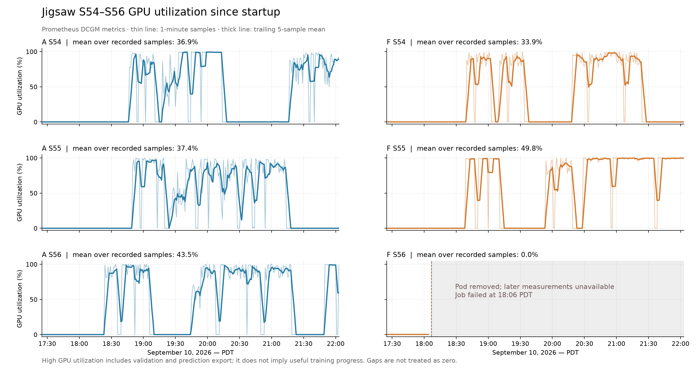

# Jigsaw S54–S56 运行中检查

检查于 2026-09-10 21:54 PDT 开始；各类快照采集时间略有不同。GPU 历史数据截至 22:03 PDT。
这是运行中快照，分数均为公开训练数据固定验证集上的 runtime 指标，未查询私有测试评分。

## 消失的 Pod

- F-S56：`mlevolve-jubias-anaf-s56-nqrtg`，运行节点 `hcc-chase-shor-c4705.unl.edu`。
- Job 17:25:12 启动，18:06:48 出现 `BackoffLimitExceeded`，18:06:57 标记 Failed。配置 `backoffLimit: 0`，没有自动重试。
- 落盘日志停在 18:04:11 的第一份 draft 的 `model_design` 生成阶段。此前有一次已重试的流式响应中断。没有注册候选、训练或结果快照；不能把那次可恢复的流式错误认定为 Pod 退出原因。
- Prometheus 留存的内存工作集峰值 3.55 GiB，容器及 Pod 的 OOM 计数均为 0；留存的 GPU 利用率样本均为 0%。这些证据不支持训练 OOM。
- Pod 对象已删除，相关 Kubernetes Events 不再存在，终止原因/退出码时序也没有记录。确切删除者、是否抢占或节点操作，当前证据无法判定，需要集群审计/管理员记录。
- CPU dev pod 是另一件事：19:08:26 PDT 达到其 6 小时运行期限，状态明确为 `DeadlineExceeded`；容器 19:08:57 退出。它的退出码 137 不能解读成 OOM。共享 PVC 数据保留。读取日志通过运行中的实验 Pod 完成。

## GPU 使用

存活五个 Pod 均为 A10 23,028 MiB。21:54:51–21:55:04 的三次短采样：

| 实验 | GPU 利用率 | GPU 显存占用 | 启动后历史平均 |
|---|---:|---:|---:|
| A54 | 74–91% | 8,752 MiB | 36.9% |
| F54 | 0% | 777 MiB | 33.9% |
| A55 | 0% | 787 MiB | 37.4% |
| F55 | 98–100% | 8,258 MiB | 49.8% |
| A56 | 99–100% | 10,446 MiB | 43.5% |
| F56 | 已删除 | 无实时数据 | 留存样本 0% |

每张卡只有一个候选，另外约 0.8 GiB 显存属于控制进程的全局记忆模型。DataLoader/编译子进程属于同一候选，不是额外并发候选。

F54 与 A55 的低利用率有明显的 GPU 训练前 CPU 工作：主线程运行、约一个 CPU 核、尚未完成训练启动。F54 第三份 draft 的 `training_started` 在执行后 38.7 分钟才出现，随后在第一次反向传播报错；A55 第三份 draft 在采样时还没有该事件。对应不可变候选源码包含全量文本规范化、多轮正则和逐字符统计。不能仅凭编译 worker 的存在认定卡在编译；采样中的那些 worker 多数处于等待。

## 新机制有效，也暴露了预算和接口问题

初始 draft 生成后立即执行、单卡单候选都已在真实日志中确认。五个存活实验均已发布完整结果；四个执行后报错的候选仍保留了可评分结果，说明结果保留机制工作了。

但 **7 个已收尾候选只训练了 5 个 optimizer steps**：A54 一份 draft、A55 一份 draft、A56 一份 draft、F54 两份 draft、F55 一份 draft 和一份 debug。分数在 0.4820–0.5857。这不是到 90/120 分钟后被系统杀掉，而是 runtime 在 smoke 后主动触发 `budget_exhausted`。

根因有直接代码和事件证据：`CandidateSession._smoke()` 用首次 128 行推理耗时按数据量线性外推；`reserve_seconds()` 再计算 `1.5 × (2 × 验证 + 测试 + 保存)`；`step()` 在正式验证计时判断之前先检查这个预留。七例对完整验证的估计高出实际约 2.9–7.9 倍，初次计算的预留时间达到 106–240 分钟。超过剩余候选预算后，立即收尾；真实完整验证校准了耗时，但这个收尾分支不会返回继续训练。

例如 F54 第二份 draft：估计完整验证 42.5 分钟，实际 6.9 分钟；预留计算为 149.2 分钟，超过该 draft 总预算 90 分钟，于是在第 5 步停训，执行到 30.5 分钟完成导出，分数 0.4820。首轮小样本耗时中的固定开销被放大，与这种偏差一致；没有对底层算子逐项做性能剖析。

此外，**4 个候选在保存快照后因“CandidateSession 没有提供分数”主动抛错**。当前 `finish()` 返回 None，生成代码却猜测 `best_score`、返回字典等接口并在读取失败后抛异常。受影响的是 A56 第一份 draft、F54 前两份 draft、F55 一份 debug。应明确稳定的结果返回结构/属性并同步生成、审查提示，避免浪费 debug 轮次。

其他已捕获错误包括：3 次 checkpoint/backward 的二次反向传播错误、2 次 diff 遗留 `=======` 导致语法错误、1 次非有限预测、1 次 NumPy 字符串相加、1 次 list 被当成 Tensor 调用 `.to()`。候选错误与整个 F56 Pod 消失必须分开看。

仍有候选进行了实质训练并保存较好结果：事件记录中 A54 有 3,623 步的 0.92123 快照，A55 有 1,434 步的 0.91647，F54 有 4,572 步的 0.91415，A56 有 903 步的 0.90342，F55 正在执行的 improve 已发布 3,381 步的 0.90684；其后验证达到约 0.91032，但在本次事件快照中尚未发布该版本。不能把这些运行中验证分数当成最终 A/F 实验结论。

## 建议

优先修复 smoke 耗时估计/收尾预留和明确 `finish()` 结果接口，再优化 CPU 文本前处理、checkpoint/backward 与 diff 语法审查。现有五个实验先保留运行状态。F56 没有训练产物，后续可以单独重跑，但普通 apply 不会使已经 Failed 的同名 Job 自动重新执行。CPU dev pod 也需要重建后才能继续作为默认 fetch 通道。

本次只读集群状态、日志和监控。没有改共享源码、依赖、Job 或 Pod，没有重启实验。没有更新 UPDATELOG。

证据：`kubernetes.json`、`dev_cpu.json`、`events.json`、五份 Pod `.log`、F56 `.saved.log`、`gpu_samples.json`、`gpu_history.jsonl`、`termination_metrics.jsonl`、`runtime_summaries.jsonl`、`compact_logs.jsonl`、`candidate_errors.jsonl`。`*.workspace-runfile.py` 是工作目录中可变文件的快照，可能已被排队候选覆盖，不能将其当作当时正在执行的不可变源码。统计及绘图可用 `summarize.py` 重现。
