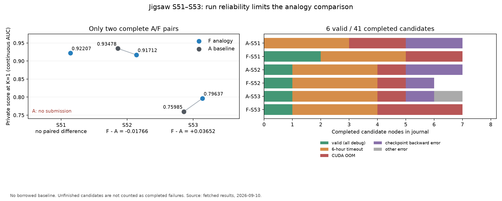

# Jigsaw S51–S53 A/F 复盘

**结论：这轮没有建立 analogy 的稳定收益，但也不足以判定 analogy 无效或有害。更强的证据是：运行失败占据了实验，F 的 improve 阶段没有产生可用于最终比较的完成节点；当前汇总还混入了一条借用旧基线的比较。**

数据来自用户已经 fetch 的 `/Users/william/nautilus/results/20260910_*jubias*` 六个运行、
`scores.csv`，以及 `results/9.10` 中的图表和分析表。原始文件、现有图表和实验代码均未修改。
[audit.json](audit.json) 保存逐节点、调用、配置和哈希；[audit.py](audit.py) 可在本机复算。

## 1. 真正同 seed、同批次的分数比较只有两组

全部采用 `scores.csv` 的 capped、K=1、`jubias-continuous-auc-v1`，grader 哈希一致。
这里没有使用 agent 自报的验证分数替代私有测试分数，也没有重新运行私有评分器。

| Seed | A | F | F−A | 有效/完成节点：A；F |
|---|---:|---:|---:|---|
| 51 | 无提交 | 0.92207 | 无法配对 | 0/7；2/7 |
| 52 | 0.93478 | 0.91712 | −0.01766 | 1/7；1/6 |
| 53 | 0.75985 | 0.79637 | +0.03652 | 1/7；1/7 |

两个完整配对一正一负，描述性均值为 **+0.00943**，不足以推断稳定效果。
S51 的 F 能提交而 A 不能，这是应单独保留的运行成功率信息：本批 F 为 3/3、A 为 2/3；样本也很少。
F-S51 的 K=2 为 0.92747，不能拿它和其他运行的 K=1 混为同一比较。

原图 draw15 使用 `20260901_192139_jubias-base-s42` 的 **0.77717** 补上缺失 A，
得到 F-S51 的“提升” **+0.14490**。这不是 S51 的配对收益。
`groups.csv` 已标记 `borrowed=A`、`seeds=42,51`，图中也用空心圈提示；但
`plot_effects.py` 仍把该差值和两个完整配对一起计算均值和置信区间，因此得到报告中的
**n=3、均值 +0.05459**。该数字不应作为这批随机种子实验的主结论。

建议主效果表只计算同批次、同 seed 的完整配对，借用对照另外展示，无提交单列；
也不应根据这个 n=3 的混合差值去估算还需要多少次实验。

## 2. 这轮主要在 debug，尚未充分测试 F 的 improve 效果

六个 journal 共 **41 个完成候选，6 个有效、35 个失败（85.4%）**：

| 结果 | 个数 |
|---|---:|
| 六小时执行超时 | 18 |
| CUDA OOM | 10 |
| checkpoint 反向传播错误 | 6 |
| AttributeError | 1 |
| 有效候选 | 6 |

**每个运行都有三次六小时超时，六个有效候选全部是 debug 节点。**
六个运行共有 19 个已完成 draft，全部失败。计数仅覆盖落盘完成节点，不把未完成的候选算成失败。
已记录进程执行时长合计 134.04 小时，其中失败进程 116.38 小时；这些进程并发运行，
**不能将该累计时长当成实际 GPU 占用小时**。

第一次有效结果出现于运行启动后约：F-S53 9.54 小时、F-S52 9.75 小时、
A-S52 10.23 小时、A-S53 10.83 小时、F-S51 10.99 小时；A-S51 始终没有有效结果。
超时堆栈主要落在训练 forward/backward、优化或排序损失计算，不能简单解释为“GPU 空闲卡住”。
多个父节点在六小时截止前连一次 epoch 末验证都未产出。

F 的 improve analogy **确实触发了四次**，不是开关没接上：

| 运行 | 生成的 improve 节点 | 生成时间（UTC） | 最终 journal |
|---|---|---|---|
| F-S53 | `78615c59…` | 12:08:36 | 无该节点完成结果 |
| F-S52 | `b75be37b…` | 12:20:27 | 无该节点完成结果 |
| F-S51 | `12680229…` | 13:42:21 | 无该节点完成结果 |
| F-S51 | `812ea678…` | 13:58:14 | 无该节点完成结果 |

这些节点后续有执行启动记录，但最终保留的得分来自更早的 debug 节点。
它们都在预算后段才开始，而父候选单次执行耗时约 2.15–4.18 小时，
**剩余预算不足是很强的解释**。只读查询时六个原 Pod 均已不存在，无法补查最终容器退出原因，
因此不把所有未完成节点的终止原因断言为已验证的整体超时。

这批保存配置仍是 3 个搜索/执行并发、6 小时单候选上限、12 小时总预算；
没有新加入的 `exec.max_parallel_run`。它们不包含本地新做的提前执行/单卡单候选改动。

## 3. 建议并非完全没有采用，但进入最终结果的路径很窄

| F 运行 | 首个 draft 的建议 | 实际代码 | 直接注入分支的结果 |
|---|---|---|---|
| S51 | 分层 pairwise AUC loss + 有界历史分数缓存 | 有 ranking loss、分组比较和缓存实现；不是只在 plan 中提到 | 已完成 2 个节点，0 有效；最终两个有效候选来自分支 2、3 |
| S52 | identity×label 的 capped inverse-frequency sampler，保持普通 BCE | `WeightedRandomSampler` 和 cell-frequency 权重一直保留到最终 DistilBERT 代码 | 已完成 3 个节点，1 有效；最终私有分数 0.91712 |
| S53 | 保守的 70/30 mixture-stratified sampler，保持普通 BCE | 有按分层优先排序的 sampler，但每行仍每 epoch 使用一次；另把 mixture 权重送进 BCE | 已完成 3 个节点，0 有效；最终有效候选来自分支 3 |

S53 的实现与建议存在偏差：建议是 sampler + 普通 BCE，实际同时改了样本顺序与损失权重。
不能说它等价于所提出的采样机制，也不能在没有有效完成结果的情况下断定该偏差导致了损害。

图表的 `adoption_source=proxy` 是标题词匹配，**不是代码级采用审计**。
S52 在表中 `n_adopted=0`，但代码明确实现并保留了建议中的采样器，因此不能把这个 0 解读为“没有采用”。

没有直接注入的其他初始分支也会看到先前设计的记忆，故不能把它们当作完全没有 analogy 影响的对照。
不过 S51、S53 最终分数确实不是来自直接注入分支的成功结果，这限制了对具体机制的归因。

## 4. 当前分数还明显受“为了跑完而换模型/冻结”的影响

- **S52**：A 最终是 DeBERTa-v3-small；F 是从 ModernBERT-large 调试改成 DistilBERT，最大长度 96，
  采样建议保留。F 的 −0.01766 值得关注，但不是“同一 backbone 加 sampler”的对照，
  无法把差值单独归因于 importance sampling。
- **S53**：A 的 ModernBERT encoder 完全冻结，只训练上层模块；F 的成功候选也冻结了 ModernBERT-base encoder，
  并把逐 identity 的 27 类排序计算简化为 identity union 下的 3 类比较。
  两者都是多轮超时后形成的折中方案，0.75985/0.79637 的差异不能直接说明 sampler 有效。
- **S51**：最终有效候选来自其他分支，一个将 ModernBERT 降为部分层可训练，另一个从 DeBERTa-large
  改为 base、只训练最后若干层。首个 analogy 分支则止于 OOM 和六小时超时。

这些模型变化本身可以属于“agent 整体策略”的效果，但会混杂“论文中的具体机制是否有效”的解释。

## 5. 全文功能有执行，但尚未形成稳定的正文证据链

| F 首个 draft | 实际阅读正文字符 | 最终注入报告的证据等级 |
|---|---:|---|
| S51 | 7,065 | abstract_only |
| S52 | 18,370 | full_text |
| S53 | 12,548 | abstract_only |

S51 读了 mixture-balancing 论文正文，最后注入的是另一篇 AUCSeg 的排序机制，其方法正文未读到；
S53 读到了包含 mixture balancing 的方法段，但提交的证据没有通过原文引用校验，最终保留摘要证据。
因此“启用了全文”和“最终机制有可核验正文依据”是两个不同指标。
这不表示读过的正文绝对没有影响模型思考，只表示其影响没有形成可核验的最终引用。

全部 7 次调用共尝试打开论文 21 次：**8 次成功、8 次 HTTP 403、5 次下载/解析超时**。
两个 improve 调用正文读取为 0。现有严格校验会拒绝在该次读取内容中找不到的引用；
仅凭日志无法区分所有失败是改写引用、选错 chunk，还是排版字符差异，不能直接宣称校验器出错。

七次调用合计 1,229.4 秒，平均约 2.93 分钟；每个 F 运行合计约 5.6–8.7 分钟。
相比反复六小时训练超时，这不是当前吞吐的主要开销，降低阅读预算不是首要措施。

## 建议下一步

1. **先让主统计忠实于实验设计**：F−A 主表仅保留 S52、S53；S51 的 A 无提交单列，借用对照不混入主均值和区间。
   分支图目前标题写着 arm E 却也包含 F，且横轴是本地 validation metric，不能当成私有分数图。
2. **先建立可靠、较早出现的有效候选，再评价 improve**：提前执行和单卡单候选能减少等待/竞争，
   但如果仍等 1.8M 样本的一整轮训练后才首次验证，单卡排队也可能耗完预算。
   优先固定一套能跑通的 backbone 和训练预算，按训练进度验证、保存可评分结果，给 improve 留出完整执行窗口。
3. **用同一代码起点检验机制**：尤其是 S52 的 sampler，在相同模型、split、token limit、训练更新数下
   做 uniform/capped weighting 的对照；否则模型替换和运行成功率会盖住机制差异。
4. **再补齐正文链路**：处理明确出现的 403/下载超时，并让报告准确引用实际返回的 chunk；
   保留对无依据引用的拒绝规则。分别记录“打开成功、读到正文、最终正文引用通过、代码落实、候选完成”。

当前不建议直接用原配置追加同样的三组长实验；先提高有效候选和可完成 improve 的比例，才更有机会回答 analogy 的效果问题。

## 核查边界

本次只分析已有文件，并只读查询了原 Pod 是否还存在。没有改图表生成逻辑、重打分、修改训练代码或提交任务。
另外生成了这份报告、结构化审计和一张不借用基线的辅助图，原图表保留。
