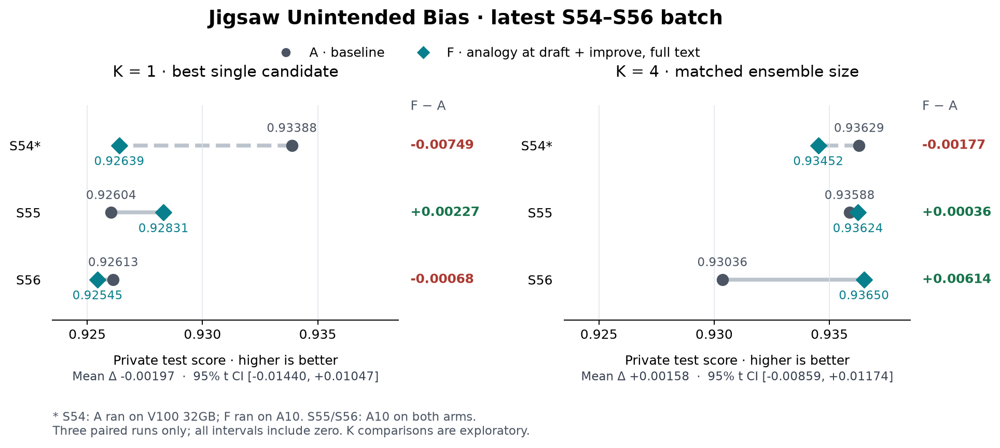

# S54–S56 最新完成批：结果、运行与 analogy 复盘

本次检查的是 2026-09-11 07xx 启动的六个 A/F run。结论是：候选运行与保存的修复已经生效；analogy 的局部改进真实存在，但当前三对结果尚不支持稳定的端到端收益。更明确的瓶颈在目标模型诊断、建议到代码的准确实现、剩余预算管理，以及公共验证选优，而非单纯缺少论文阅读量。

检查范围包括本地 fetch 的日志、分数、分析产物、analogy 报告，以及通过 CPU dev pod 补取的 75 个不可变候选源码和运行元数据。另使用现有 corrected MLE-bench grader，对 45 个候选各自公共验证最高的已保存提交做事后私有评分。没有重新训练、改变模型选择、覆盖原分数或原图，也没有修改生产代码、Job 或集群文件。新文件均在本报告目录。

## 最新三对的正式结果

| Seed | A K1 | F K1 | F−A K1 | A K4 | F K4 | F−A K4 |
|---|---:|---:|---:|---:|---:|---:|
|54|0.93388|0.92639|−0.00749|0.93629|0.93452|−0.00177|
|55|0.92604|0.92831|+0.00227|0.93588|0.93624|+0.00036|
|56|0.92613|0.92545|−0.00068|0.93036|0.93650|+0.00614|

K1 平均差 −0.001967，95% t CI [−0.014401, +0.010468]。共同 K4 平均差 +0.001577，95% t CI [−0.008591, +0.011744]。只有三对，K 比较属于事后探索，且 S54 的 A 是 V100 32GB、F 是 A10；其余两对均为 A10。不能宣布有稳定收益，也不能据此确认无效。K4 的弱正信号主要由 S56 驱动。

六个实验 Pod 均 Succeeded、零重启，CPU dev pod Running。最新六个没有借用 baseline；每对 A/F 使用完全相同的 contract_id、公共数据及 split.npz hash，grader 均为 jubias-continuous-auc-v1，SHA256 相同。六个 best_submission/top1 内容一致，全部 45 个候选提交文件 hash 通过核验；75/75 源码匹配注册记录，45/45 worker_finished 的分数与快照匹配。最终输出可信。

现有综合图需谨慎解释：主 summary 的 F−A +0.02631 混合 S51–53 与 S54–56，还包含 S51 借旧 seed42 baseline 形成的 +0.14490；它不是新版效果。analogy_score_F 虽排除借基线，仍混合两个执行版本。另 analogy_summary.csv 按 seed 后缀匹配 effect，错误地把最新 S54/S55 效果贴到旧 invalid 同 seed run；主图未把这些旧失败 run 重复计入。详见 [scores_notes.md](scores_notes.md)。

## F56 的最终 K1 掩盖了一次有效改进

| F56 候选 | 公共 validation | 事后 private | 在正式选择中的位置 |
|---|---:|---:|---|
|4eed868e 首 draft|0.926935|0.92545|top1，正式 K1|
|c87f0ec8 后续 improve|0.926396|0.93096|top2，进入 ensemble|
|b1738447 再次 improve|0.692728|0.69590|未入 top4/top6|

c87 在公共验证上只低 0.000540，私有测试却高 0.00551。这是已经观察到的排名逆转，说明“最终单模型未提高”不能等同于“搜索过程没有找到更好的模型”。预设按公共分数选择的流程执行正确；不能看过 private 后改报其最高分。

F56 K1→K2 从 0.92545 提到 0.93353，贡献了 K1→K4 增益的约73%。K2 又比 c87 单模型高 0.00257，因此既包含把未被选为 top1 的更强候选纳入，也存在组合超越两者的收益。这里 K2 使用现有公共分数与排名形成的权重，并非等权平均。还不能认定收益由 analogy 带来的独有多样性造成。

c87 实现的是 0.5 BCE + 0.5 batch ranking，但当次最终报告保留的是 adversarial debiasing/influence-guided correction，建议与实现并不一致；它还比首 draft 训练更多步（4714 vs 1255），预算也不同（120 vs 90 分钟）。因此不能将 +0.00551 单独归因某篇全文论文或 loss。

其余四个 run 公共选中的 top1 也是此次已保存候选中的 private 最高者；A55 的差距仅 0.00008。选优问题在本批主要集中于 F56。[全部补评分](candidate_private_scores.jsonl)保留输入提交 hash、验证分数、private 分数和 grader provenance。

## analogy 有实际干预，但几种失败必须分开

三组 F 的最终最佳模型都来自首个直接注入 analogy 的 draft 分支。F54 首 draft 使用 identity×toxicity cell 的 EMA 风险加权；F55 使用 identity×label 逆频率加权；F56 使用负类下采样和类别平衡采样。这不是“报告根本没注入”。它们多为论文机制的简化迁移，而非论文完整算法。

F54 主分支的 private 轨迹是 0.91679→0.91451→0.92639；F55 为 0.92728→0.92798→0.92831；F56 为 0.92545→0.93096→0.69590。同分支演化不能代替同预算消融，但说明局部效果并非全为负。

**明确实现错误：F56 的 cross-batch memory 排序方向写反。** b173 的 `_sample_direction` 始终计算 `softplus(stored-current)`。对于“当前正例+缓存负例”正确；对于“当前负例+缓存正例”应计算 `softplus(current_negative-stored_positive)`，现实现反向鼓励抬高负例分数。它实际训练了 5206 步，三个公开验证分数都约0.69，private 也跌至0.69590。这是确定的实现错误，很可能是暴跌的重要原因；尚未做单变量重跑，不能定量归因全部差距。F55 的 FIFO 实现方向正确且未崩溃，因此不能泛化成 memory/类比有害。代码证据在 [b173 solution.py](cluster_sources/20260911_072611_jubias-anaf-s56/b1738447ec61460dbe32f74c6978e42b/solution.py) 的417–449行。

**预算不足：两个约0.5的快照不构成有效机制试验。** F54 1d927b42 与 F55 c3270863 都只训练5步。后者 adaptive multiplier 要第200步才触发，实际没有检验该机制。它们在队列里等了数小时，到执行时剩余预算被预处理、验证、导出用完。

**实现过度简化：** F56 580ae 报告提出 frozen backbone + soft prefix/classifier，最后代码只训练新 classifier，未保留 soft prefix；19002步后公开分数0.82156、private 0.81016。后续解冻末层仅部分恢复。这个结果不能用于否定一般 PEFT 或论文原机制。

这些差异在单一“adopted 后分数升降”统计里会被混为一谈。详见 [analogy_notes.md](analogy_notes.md)，其中包含全部19个注册 improve 的流转与代码证据。

## 全文确实读了，目标诊断与证据落地仍较弱

23 次 analogy 调用成功打开45次、涉及21篇不同论文；49次 read 共返回约26.1万字符。每次至多3次 read，未用满12次/40k字符预算；三组总耗时约44分钟，每 run 13–16分钟。继续增加阅读额度不太像当前首要限制。

43 条最终机制中20条 full_text、2条 mixed、21条 abstract_only，7次报告全部退回摘要证据。22/23次调用出现引用未在返回文本中找到的拒绝，累计88条；另有24次打开失败，主要是 OpenReview 下载失败。打开失败、引用不匹配、最后主动采用摘要是不同情况。未恢复每次被拒绝的原始提交，不能断言引用失败全是幻觉或全是抽取格式问题，也不建议直接放松校验。

更关键的是，若干报告用任务通用背景推断该候选存在 identity shortcut，缺少其 subgroup/BPSN/BNSP AUC、错误样本或 pair coverage。F56 一个已有0.5 ranking loss 的候选，下一份报告还称其 surrogate 主要 pointwise。许多报告写了最小验证方案和 rejection criterion，但实际执行没有记录对应诊断，形成“假设直接变成修改依据”的问题。

资源信息也不一致：[engine/analogy/agent.py](/Users/william/Documents/project/python/MLEvolve/engine/analogy/agent.py:934) 的 `_resources` 仍从 cfg.exec.timeout 告知每个 solution 6小时；本批实际 draft90分钟、其他120分钟，最后还受总截止缩短。有些 improve 文案又沿用1小时。需要向 agent 提供执行时的真实预算和成本，而非只提供静态旧配置。

用户的 example_analogy_draft.md 仍是旧 S48 示例，不是本批记录；本报告以本批 logs/analogy 为准。

## 运行修复有效，浪费已转移到其他环节

| Run | 执行尝试 | 可评分 | failed | timeout | 队列未执行 |
|---|---:|---:|---:|---:|---:|
|A54|9|7|1|1|2|
|A55|9|7|1|1|2|
|A56|12|7|4|1|2|
|F54|9|7|0|2|1|
|F55|15|8|6|1|1|
|F56|12|9|2|1|1|
|合计|66|45|14|7|9|

66次执行尝试含 AST 提前拒绝，不代表全部训练过。45个完整可评分均正常 finish，无此前分数接口异常；49个有完整验证对照的 smoke 中48个误差在±10%。唯一约2倍估计是 F56 尾部不足时间、跳过校准的 fusion draft。正常 `budget_exhausted` 表示主动收尾，不能计为失败。

7次 timeout 中6次撞总 run 截止，4次启动时只剩3–10分钟。另一次是 F54 DeBERTa-large 候选：24.5分钟预处理、25.7分钟完整验证，复验加 test 已无法装入90分钟，最终导出未完成。估计基本准确，但没有据此拒绝不可能完成的方案。

14个 failed 包括8次diff语法/缩进、3次二次反传、3次缺C编译器。AST失败本身通常不到1秒，主要损失在生成/排队/反复修补反馈，不能把它们全当成长训练浪费。A55 上次观察到I/O等待的候选最终正常完成20550步，不是死锁；另一个尾部候选的最终卡点缺少细分事件，无法确定在保存、重载还是 test。

六个run候选占用执行槽合计69.26小时，已完成验证11.19小时、导出19.83小时，合计44.78%；已知 training_started 前阶段还占16.68%。这是墙钟占槽，不是GPU活跃率，验证和导出也在使用GPU。未完成阶段和checkpoint写入没有全部细分，剩余比例不能直接称纯训练。没有同卡多候选重叠或队列死锁；但注册到执行等待中位105分钟、最长242分钟，导致规划和反馈陈旧。

进一步细节见 [runtime_notes.md](runtime_notes.md)。六个 journal 均遗漏尾部节点，F54 还漏一个完整低分候选，所以本次计数使用 candidate_results 与执行事件，而非只看 journal。

## 建议优先级

1. **先补目标诊断与实现核验。** 把真实 subgroup/BPSN/BNSP 指标、pair coverage、训练进度、实际采用/拒绝机制与成本反馈给 analogy，明确区分观测与假设。新排序/加权机制先做廉价的方向和梯度检查；diff 在入队前检查语法。不要让实现错误作为“论文方法无效”进入记忆。
2. **按真实剩余预算接纳候选。** 执行前重估预处理、验证、重载复验与导出成本；总截止前不再接纳只有几分钟训练窗口的大候选。把正确的90/120分钟上限和队列后的剩余时间同步给生成与检索。
3. **固定同硬件、同预算做小型机制消融，再增加整 run。** 优先复验正确方向的 ranking/FIFO，隔离 loss 改动与训练步数差异。K1 与预设固定K融合同时报告，保留公共选优；候选 private 评分只作为已结束实验的诊断。针对 F56 的公共/私有排名逆转，可研究公共验证上的配对不确定性和稳定性，不能反向用 private 调参。

当前不建议把“扩大 web search / 阅读预算”作为首要投入。阅读能力已经可用，诊断事实、实现忠实度和可执行预算更直接限制这批结果。

## 可复查文件

- [正式分数审计](scores_notes.md)、[结构化评分审计](scores_audit.json)
- [运行审计](runtime_notes.md)、[逐候选事件摘要](runtime_audit.json)
- [analogy 审计](analogy_notes.md)、[结构化 analogy 数据](analogy_audit.json)
- [45个候选事后评分](candidate_private_scores.jsonl)、[源码与快照完整性](source_integrity.json)
- [集群最终状态](cluster_status.json)、[独立本批图 PNG](latest_paired_scores.png)、[PDF](latest_paired_scores.pdf)
- [补取源码脚本](fetch_review_sources.py)、[只读事后评分脚本](grade_review_candidates.py)

原始数据：`/Users/william/nautilus/results`。本批 A54/A55/A56 的 run 分别为 `20260911_071931_jubias-base-s54`、`20260911_072108_jubias-base-s55`、`20260911_072344_jubias-base-s56`；F54/F55/F56 分别为 `20260911_072808_jubias-anaf-s54`、`20260911_072611_jubias-anaf-s55`、`20260911_072611_jubias-anaf-s56`。00xx中断批与06xx启动失败批均未纳入新版效果。
